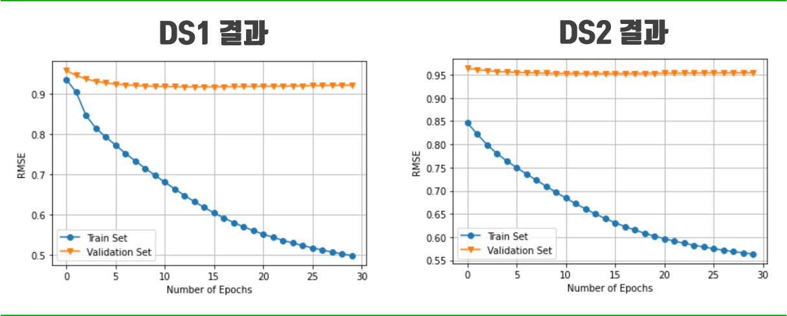

# Matrix Factorization Recommender System

## 0. Code Overview

### Usage

```shell
# train
$ python main.py --model AddPMF --data_type DS2 --alpha 0.5 --reg 0.04 --lr 0.0005

# inference
$ python main.py --test True --model AddPMF --data_type DS2
```


### Directories

```
README.md

model
  ├── add_pmf.py   # AddPMF model 
  ├── bias_pmf.py  # BiasPMF model 
  └── pmf.py       # PMF model

utils
  ├── data.py  # get_data & train_test_split
  ├── utils.py  # rmse & time_since & to_csv
  └── types_.py  # type hint
  
report
  └── README.md  # README.md for report
  
main.py  # train/test

========= After running main.py (train), the directories are created as below. =========

data
  └── ml-20m
     ├── ratings.csv
     └── ...(etc.)

outputs
  ├── DS1  # 과제1 Dataset
  │   ├── results
  |   |   └── output_val_{model_name}.csv  # best model에 대한 결과 csv 
  │   └── weights
  |       └── best_model_{model_name}.npz  # best model weights
  └── DS2  # 과제2 Dataset
      ├── results
      |   └── output_val_{model_name}.csv
      └── weights
          └── best_model_{model_name}.npz
 
========= After running main.py (test), the files are created as below. =========

B_results_DS1.csv
B_results_DS2.csv
```


# Matrix Factorization Recommender System

## 1. 소개

### 1.1. Matrix Factorization

- Matrix Factorization(MF)은 추천 시스템의 협업필터링(CF, Collaborative Filtering) 기법 중 Latent Factor 모델에 해당함
- Latent Factor 모델은 아래의 그림과 같이 User와 Item을 $K$-차원을 가지는 latent vector로 표현하는 모델임
- 그 중 MF는 User와 Item을 $K$-차원을 가지는 동일한 latent space에 매핑함  


### 1.2. Singular Vector Decomposition(SVD)

- MF 모델에서 가장 일반적인 방법 중 하나는 SVD(특이값 분해)가 있음
- 하지만, SVD는 데이터의 수가 커질수록 연산 속도가 매우 느려지는 문제가 발생함
- 또한, 대부분의 Rating Matrix($\mathbf{R}$)가 매우 sparse하기 때문에 성능이 좋지 않음


## 2. 모델 구현

### 2.1. Probabilistic Matrix Factorization(PMF)

- Rating Matrix $\mathbf{R}$ 의 분해값에 해당하는 User Matrix $\mathbf{U}$와 Item Matrix $\mathbf{V}$ 를 가우스 분포 $\mathcal{N}(0, \sigma^{2})$를 사용하여 추정하는 모델임


- $\mathbf{U}$, $\mathbf{V}$를 학습하기 위해, SGD(Stochastic Gradient Descent) + Momentum($\beta\$)을 사용함
- $\mathbf{U}$ 을 SGD + Momentum을 사용하여 학습하는 방법은 아래의 수식과 같음

$$
\begin{align*}
\mathbf{E} &= \mathbf{R} - \mathbf{U}^{\mathsf{T}}\mathbf{V} \\ \\
\mathbf{M} &\leftarrow \beta \mathbf{M} - \eta \frac{\partial \mathbf{E}}{\partial \mathbf{U}} \\
\mathbf{U} &\leftarrow \mathbf{U} + \mathbf{M}
\end{align*}
$$

- 추정하고자하는 $\hat{\mathbf{R}}_{ij}$ 은 아래의 식과 같이 계산할 수 있는데, 이 때 $\pmb{\mu}$는 전체 rating의 평균을 의미함

$$
\hat{\mathbf{R}}_{ij} = \mu +\mathbf{U}_{i}^{\mathsf{T}}\mathbf{V}_{j}
$$


### 2.2. PMF + Bias terms (BiasPMF)

- bias를 추가하여 각 User 및 Item 간의 특성을 반영해 줌
- 2.1에서 살펴본 PMF 모델에 $\mathbf{U}_i$에 해당하는 bias $\mathbf{b}_{\mathbf{U}_i}$와 $\mathbf{V}_j$의 bias $\mathbf{b}_{\mathbf{V}_j}$ 를 추가해 줌

$$
\hat{\mathbf{R}}_{ij} = \pmb{\mu} +\mathbf{U}_{i}^{\mathsf{T}}\mathbf{V}_{j} +\mathbf{b}_{\mathbf{U}_i} + \mathbf{b}_{\mathbf{V}_j}
$$


### 2.3. BiasPMF + User/Item Specific Ratings (AddPMF)

- 2.2에서 살펴본 BiasPMF 모델에 각 User 및 Item 간의 특성을 더 반영해주기 위해 User 및 Item에 대한 content-based 정보를 반영해 줌
- 각 User들이 과거에 부여한 rating의 평균을 User별로 따로 사용함 → $\pmb{\mu}_{\mathbf{U}_{i}}$  
- 마찬가지로, Item들이 과거에 부여받은 rating의 평균을 Item별로 따로 사용함 →$\pmb{\mu}_{\mathbf{V}_{i}}$ 
- 이러한 User 및 Item의 specific rating을 아래와 같이 가중평균하여 적용해줌


## 3. 실험 및 결과 

### 3.1. MovieLens-20m 데이터셋

- MovieLens 데이터셋은 추천 시스템 분야에서 대표적인 benchmark 데이터셋에 해당함
- 그 중 MovieLens-20m는 138,000 명의 사용자가 27,000개의 영화에 대해 2천만개의 rating으로 구성되어 있음 

### 3.2. 실험 환경 구성

- 과제1 및 과제2를 아래의 표와 같이 구성하여 학습 및 평가를 진행함

|                 |               과제 1 (DS1)               |          과제 2 (DS2)          |
| :-------------: | :--------------------------------------: | :----------------------------: |
| **학습 데이터** | 2005-01-01 ~ 2008-12-31<br />(5,187,587) | ~ 2013-12-31<br />(19,152,913) |
| **평가 데이터** |  2009-01-01 ~ 2009-12-31<br />(930,093)  |  2014-01-01 ~<br />(847,350)   |

- PMF, BiasPMF, AddPMF 3 가지 모델에 대해 아래의 표와 같이 동일하게 설정해 줌

| 하이퍼파라미터 |                    값                     |                            설명                            |
| :------------: | :---------------------------------------: | :--------------------------------------------------------: |
|    **seed**    |                    42                     |                     NumPy random seed                      |
|   **epoch**    |                 [20, 30]                  |                         학습 횟수                          |
| **batch_size** |                  100,000                  |                        배치 사이즈                         |
|  **features**  |      [3, 5, 10, 50, **<u>100</u>**]       |                   latent vector 차원 수                    |
|    **reg**     | [0.01, 0.02, **<u>0.04</u>**, 0.05, 0.1]  |                  regularization 파라미터                   |
|  **momentum**  |           [0.8, **<u>0.9</u>**]           |                        모멘텀 계수                         |
|     **lr**     | [0.0001, <u>**0.0005**</u>, 0.001, 0.005] |                       learning rate                        |
|   **alpha**    |   [0.4(DS1), **<u>0.5</u>(DS2)**, 0.6]    | AddPMF에서 사용하는 <br />User/Item specific rating 가중치 |


### 3.3. 결과

- 각 모델의 평가 데이터에 대한실험 결과는 아래의 표와 같음

|    모델     |      DS1-RMSE       |      DS2-RMSE       |
| :---------: | :-----------------: | :-----------------: |
|   **PMF**   |      0.916761       |      0.954441       |
| **BiasPMF** |      0.916812       |      0.954441       |
| **AddPMF**  | **<u>0.910013</u>** | <u>**0.950999**</u> |

- 위의 표에서 확인할 수 있듯이, User 및 Item의 specific rating을 적용한 모델인 AddPMF가 DS1과 DS2의 데이터셋에 대해 성능이 가장 높게 나타남
- 위의 결과를 통해, User 및 Item에 대한 content-based 정보가 성능에 유의미하다는 것을 확인할 수 있음
- PMF와 BiasPMF의 결과를 비교해 보았을 때, $\mathbf{U}_i$에 해당하는 bias $\mathbf{b}_{\mathbf{U}_i}$와 $\mathbf{V}_j$의 bias $\mathbf{b}_{\mathbf{V}_j}$ 의 영향이 거의 없다는 것을 확인할 수 있음
- 하지만 아래의 그림과 같이 학습 데이터와 평가 데이터 간의 성능 차이가 매우 크며, 학습이 진행 될수록 오버피팅이 되는 문제가 발생함 




